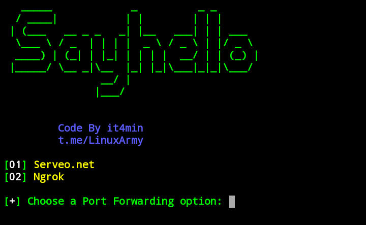

# sayhello

<h1>Hack Microphone<h1>
microphone hacking tool by sending link to target

<h1>prerequisites</h1>
<pre><code>
$ apt update  
$ apt upgrade  
$ apt install php git openssh -y  
</pre></code>

<h1>run</h1>
<pre><code>
$ git clone https://github.com/it4min/sayhello  
$ cd sayhello
$ bash sayhello.sh
</pre></code>
<a href="t.me/LinuxArmy "> Telegram Channel  </ a>
